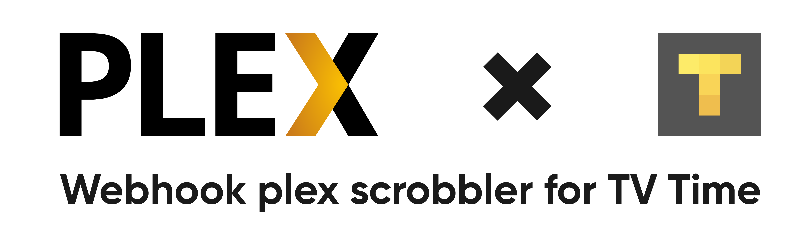

# 

## Build
For more detailed information, head out to the [aws official documentation.](https://docs.aws.amazon.com/lambda/latest/dg/golang-package.html)
### macOS and Linux
1. Compile the executable `GOOS=linux go build out/main.go`
2. Create a deployment package by packaging the executable in a .zip file `zip out/function.zip out/main`

### Windows
1. Download the build-lambda-zip tool from GitHub `go.exe get -u github.com/aws/aws-lambda-go/cmd/build-lambda-zip`
2. In PowerShell, run the following (build-lambda-zip.exe should be in your GOPATH):
```powershell
$env:GOOS = "linux"
$env:CGO_ENABLED = "0"
$env:GOARCH = "amd64"
go build -o out/main main.go
%USERPROFILE%\Go\Bin\build-lambda-zip.exe -output out/main.zip out/main
```
## Deploy
The application is made to work in an AWS Lambda function. Simply upload the zip file containing the compiled function to aws.

## Usage
Invoke the function with an API Gateway, get the api endpoint. It will be your webhook URL. You can also use your own domain name, check the [official documentation](https://docs.aws.amazon.com/apigateway/latest/developerguide/how-to-custom-domains.html) for more information.

Webhooks are configured under **Account** settings in Plex Web App (the Account item under the top right user menu).

Your Webhook URL should contains query parameters :

| name        | description                            |
|-------------|----------------------------------------|
| accessToken | Your TV Time account API access token  |
| username    | Your plex username                     |

Example: `https://example.com/?accessToken=2rhixl6934eq1gx1o86erj431szfp8q8&username=Pixselve`

## Local development
Install and configure [SAM (AWS Serverless Application Model)](https://docs.aws.amazon.com/serverless-application-model/latest/developerguide/serverless-sam-cli-install.html).

Use `sam local start-api` to start a local development server.